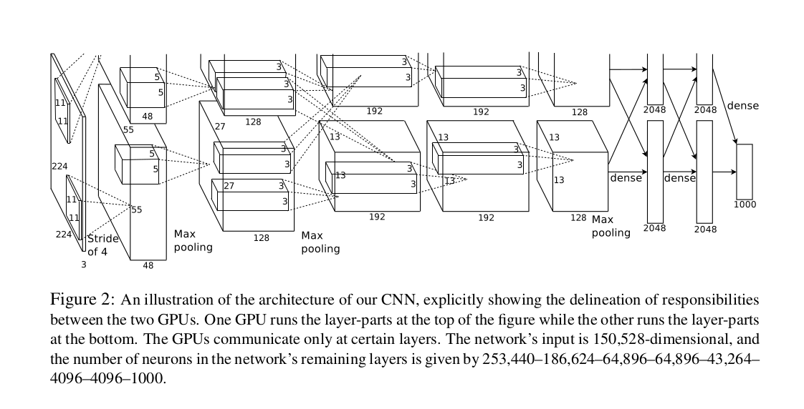
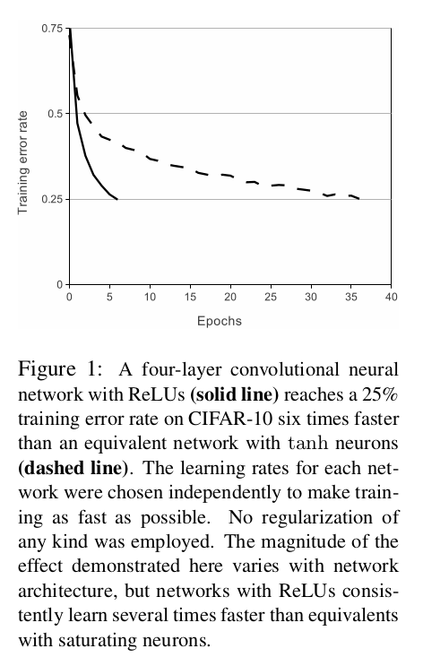
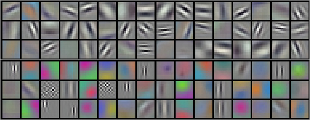
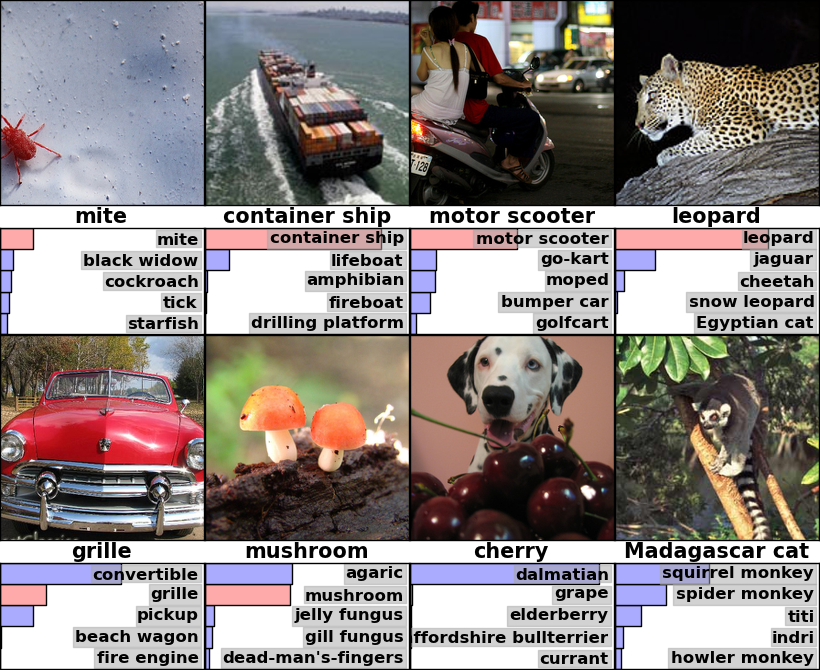

# AlexNet 论文精读

今天重新读了一遍 **《ImageNet Classification with Deep Convolutional Neural Networks》**，也就是大家所说的AlexNet。[论文地址](https://proceedings.neurips.cc/paper/2012/file/c399862d3b9d6b76c8436e924a68c45b-Paper.pdf)

这篇论文放在2026年来看，可以说是非常久远了，但对视觉任务来说，它至少是一个开创性的转变。我的一个直观感受是，AlexNet并不是因为它只提出了某一个特别新的模块，而是它第一次把几件事组合到了一起：
1. 更深的CNN
2. 数量大的ImageNet数据集
3. GPU并行训练。
4. 数据增强
   
这一套组合拳，直接把传统手工特征路线转向黑箱炼丹时代。

## 模型架构

论文中提到这张架构图，一开始其实会觉得它没有后来那些网络那么复杂，整体主干也很清楚：5层卷积层加3层全连接层，最后接一个1000类的softmax做分类。

论文里给出的几个关键数字我觉得很值得记一下：
- 参数量大约 6000 万
- 神经元大约 65 万
- 输入图像先缩放到 `256x256`，训练时随机裁 `224x224`
- 最终任务是 ImageNet 的 1000 分类

如果按今天的眼光看，AlexNet的结构其实有不少特别之处。比如第一层就用了`11x11`的大卷积核，步长还是`4`，很显然了现在大家通常不会这么干，似乎大家约定俗成，没有采用这样的参数，也许是因为信息丢得太快，但回到**2012**年，由于算力不足，训练都成问题的时代，这种设计往往能快速压缩图片，减少计算量，是很现实的工程取舍。

论文里还特别强调了一点，这个网络是分布在两张GPU上训练的。也就是说AlexNet从一开始就不是一个可复制的模型，而是一个很明显受硬件条件约束的系统设计（特别是两个gpu的卷积核共用这一块，大家似乎不care）。

## 特色
### ReLU
这篇论文把传统常见的激活函数sigmoid/tanh换成了简单直观的ReLU：
$$
f(x)=\max(0,x)
$$
似乎Relu更简单，模型收敛更快了。

论文里给了一个很有代表性的实验图：同样是四层卷积网络，ReLU 的收敛速度明显快于 `tanh`。作者直接说，在他们的实验里，ReLU 网络达到相似训练误差的速度大约是 `tanh` 网络的 6 倍。

这一点现在看好像已经是常识，但放在当时其实非常关键。因为如果激活函数本身就让训练变慢、梯度变差，那你根本没机会去尝试更大、更深的网络。换句话说，ReLU 不只是一个小技巧，它是 AlexNet 能被训练起来的前提之一。

### 双 GPU 训练
论文里用的是两张 NVIDIA GTX 580 3GB。现在看这个显存很小，但在当时已经是很强的配置了。
论文里提到：
- 第 2、4、5 个卷积层只连接同一张 GPU 上的特征图
- 第 3 个卷积层会跨两张 GPU 通信
- 全连接层再把信息汇总起来
  
有点奇怪，一开始觉得为什么不保持一致性，这让我觉得 AlexNet 的突破并不是只来自算法设计，更多考虑了工程的优化。

### LRN
论文里还有一个今天不太常见的模块，叫 Local Response Normalization。计算公式：

$$
b_i=\frac{a_i}{(k+\alpha\sum_j a_j^2)^\beta}
$$

它本质上是在相邻通道之间做一种竞争，让响应特别大的神经元不要一家独大。作者认为这能带来一定的泛化提升。

不过从今天回头看，LRN 更像是历史阶段里的有效技巧。后面 BatchNorm 等归一化方法出现之后，它就慢慢退出主流了。所以我会把它理解成：AlexNet 在当时为了把性能再往上推一步，用上的一块拼图，但不是后来长期保留下来的核心思想。

### Overlapping Pooling
AlexNet 另一个我觉得挺有意思的地方，是它没有用最传统的不重叠池化，而是用了 overlapping pooling。
论文里的设置是：
- pooling size `z = 3`
- stride `s = 2`

也就是说相邻池化区域之间是有重叠的。作者报告说，这样做相比不重叠池化，错误率还能再降一点，而且更不容易过拟合。
这个点本身不算惊艳，但它能说明作者不是只靠一个大招取胜，而是在很多训练细节上都认真调过。

### 数据增强
论文用了两种非常经典的数据增强方式。第一种是**随机裁剪和水平翻转**。训练时从 `256x256` 的图像里随机取 `224x224` patch，再做镜像。测试时则取四角和中心共 5 个 patch，再加上镜像，一共 10 个 patch 做平均预测。

第二种是**RGB PCA扰动**。简单理解，就是沿着颜色主成分方向给图像加一点随机变化，模拟不同光照和颜色条件。论文说这一步能让 top-1 error 再下降 1% 左右。

### Dropout
Dropout 是这篇论文里另一个很经典的点。作者把它用在前两个全连接层，训练时每个隐藏单元有 `0.5` 的概率被置零。

它的直觉其实很好理解：不要让某几个神经元彼此过度依赖，不要让网络学出太脆弱的共适应关系。这样即使随机拿掉一部分单元，模型还是得学会稳定地表达特征。

论文里也很直接地说了，没有 dropout 的话，这个网络会出现明显过拟合；用了 dropout 之后，虽然收敛会慢一些，但泛化能力会更好。

## 训练细节
这篇论文在训练设置上其实并不花哨，但几个数字很有代表性：

- 优化器是 SGD
- batch size 是 `128`
- momentum 是 `0.9`
- weight decay 是 `0.0005`
- 初始学习率是 `0.01`
- 当验证误差不再下降时，就把学习率除以 `10`

训练大概跑了 90 个 epoch，用两张 GTX 580 训练了 5 到 6 天。

这里有个细节我挺喜欢，作者说 `weight decay` 不只是起正则化作用，还会降低训练误差。这种表述很实在，不是把它当作一个固定教条，而是把它当作实际实验里观察到的有效设置。

## 实验结果
AlexNet 最震撼的地方，还是结果。

在 ILSVRC-2010 上，论文报告的结果是：
- top-1 error：`37.5%`
- top-5 error：`17.0%`

而在它之前，比较强的方法比如 sparse coding、SIFT + Fisher Vector，top-5 error 还在 `28.2%` 和 `25.7%` 这个量级。这个差距已经不是“小幅领先”了，而是很明显的代际差异。

在 ILSVRC-2012 上，作者进一步通过多模型集成和在 22K 类 ImageNet 上预训练，把 top-5 error 做到了 `15.3%`，而比赛第二名是 `26.2%`。看到这里就会明白，为什么很多人会把 2012 年当作计算机视觉全面进入深度学习时代的标志点。

## 可视化结果

第一层卷积核的可视化很有意思，已经能明显看到边缘、方向和颜色块。也就是说，网络最底层学到的东西，和传统视觉里手工设计的一些低层特征其实有相通之处，只不过现在这些特征是数据自己学出来的。

从 top-5 预测图里也能看出来，这个模型很多时候即使第一预测没对，给出的候选也常常是语义上接近的类别。这说明它不是简单记住标签，而是真的学到了一些较高层的视觉表示。

## 总结

读完 AlexNet 之后，我觉得这篇论文最重要的地方可以概括成三点。

1. 它证明了深卷积网络在大规模图像分类上是可行的，而且能显著超过传统方法。
2. 它的成功不是靠某一个孤立技巧，而是 ReLU、GPU、数据增强、dropout、模型规模这些因素一起起作用。
3. 今天很多具体设计已经被更现代的网络替代了，比如 LRN、大卷积核和厚重的全连接层，但 AlexNet 打开的方向没有变，那就是让模型自己从大数据里学表示，而不是继续依赖手工特征。

如果把 AlexNet 放回历史位置去看，它不像后来的 ResNet、Transformer 那样结构上很优雅，但它足够关键。因为它不是在原有路线里做一点修补，而是直接把视觉任务的主流范式改掉了。
