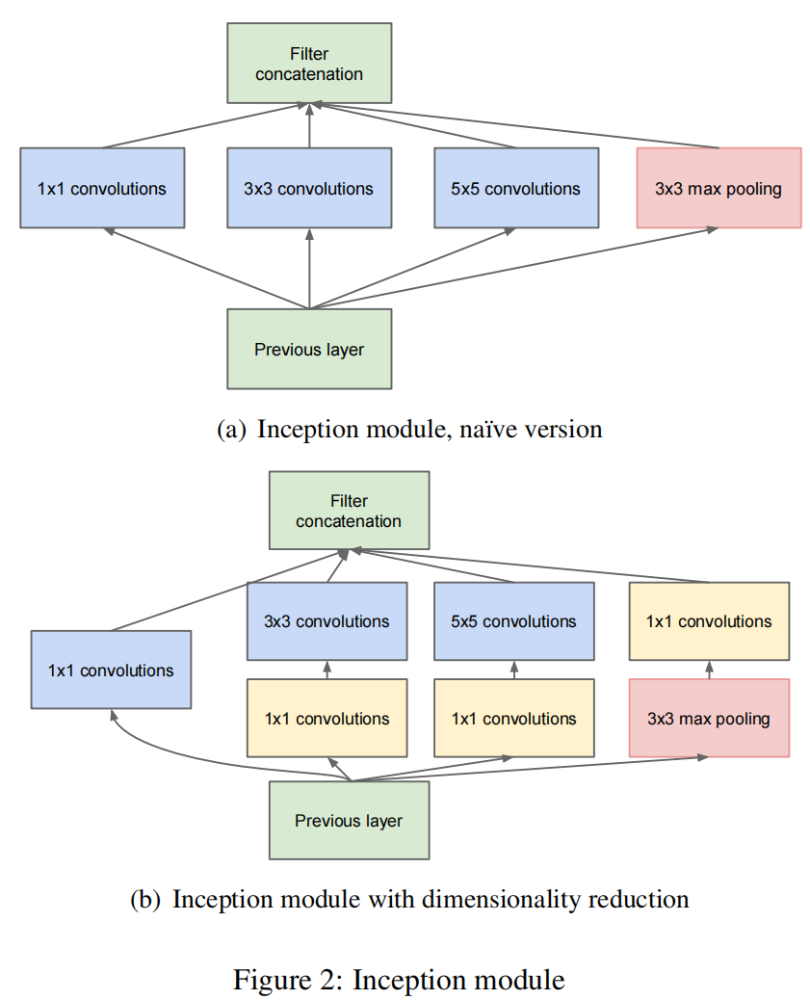
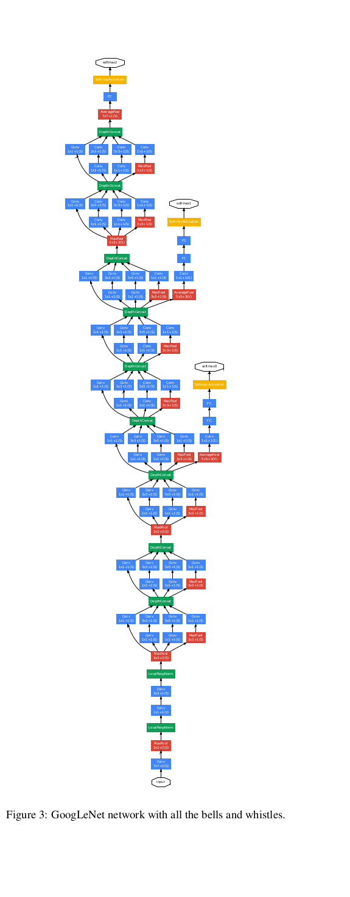

# GoogleNet 论文精读

## 前言

今天看这篇 **《Going Deeper with Convolutions》**，也就是GoogleNet。[论文原文](https://www.cv-foundation.org/openaccess/content_cvpr_2015/papers/Szegedy_Going_Deeper_With_2015_CVPR_paper.pdf)

GoogleNet表面上是在回答怎么把CNN做得更深，但真正解决的问题其实更现实一些，那就是如果继续堆深度和宽度，计算量和参数量会很快失控，那有没有一种办法，既把表达能力做上去，又别把网络做成一个只适合比赛榜单的神器？

如果把AlexNet看成**深度CNN**的开场，把 VGG看成**把网络堆深**，那GoogleNet更像是另一条路线。它不是一味往深处加，而是如何优化模型，它第一次把**多分支、多尺度、降维、省参数**这几件事比较完整地揉在了一起。

## 模型架构

GoogleNet也叫**Inception**。作者在摘要提到这是一个 `22` 层的网络，在保持计算预算基本可控的前提下，同时把深度和宽度都做上去了

论文里还特别强调，大多数实验都把推理计算量控制在大约 `1.5 billion multiply-adds`。这句话我觉得很重要，因为它说明作者从一开始就不是只盯着2014年的imagenet大赛的榜单分数，而是在想这么大的计算量，这个网络能不能真的跑起来。

Inception模块的直觉其实不复杂：
同一层把`1x1`、`3x3`、`5x5` 和pooling并联起来，让网络自己去决定更该看局部结构，还是更粗的上下文。最后再把这些分支的输出拼接起来。

但作者马上就指出，直接这么做会有一个很现实的问题：`3x3`和尤其`5x5`卷积太贵了，分支一多，计算量很快就会炸掉。所以**Figure 2(b)** 才是这篇论文真正落地的关键，也就是先用 `1x1` 卷积做降维，再去做贵的卷积运算。
它一边压通道数，一边带上 ReLU 非线性，相当于先把信息压缩到更便宜的表示里，再交给大卷积处理。可以看出来，GoogleNet不只是多分支，而是它知道哪些地方该放开做，哪些地方必须先省着花。

完整网络就是把这种模块一层层叠起来。主干大致可以概括成：

- 前面先用传统卷积 stem 做初步特征提取
- 中间堆叠 `9` 个Inception模块：`3a`、`3b`、`4a` 到 `4e`、`5a`、`5b`
- 在 `4a` 和 `4d` 位置额外接两个辅助分类器
- 最后不是厚重的全连接堆叠，而是 `7x7` average pooling、dropout 和线性分类层

### Inception如何解决计算分配

我觉得很多人第一次接触GoogleNet，会把注意力都放在“网络更深了”或者“分支变多了”。但读完原文之后，我更在意的是它背后的资源分配逻辑。

论文一开始就讲得很明白：简单把网络 uniformly 做大，会同时带来两个问题：

- 参数量暴涨，更容易过拟合
- 计算量暴涨，很多算力其实会被浪费掉

所以 Inception 模块本质上是在做一件事：用当前硬件友好的 dense 计算，去近似一种更理想的 sparse 结构。这个说法听起来有点学术，但翻成更直白的话就是，作者想要的是“该复杂的地方复杂，该便宜的地方便宜”，而不是每一层都一刀切地堆同样多的卷积。

也正因为这样，GoogleNet给我的感觉不是“更大”，而是“更会花钱”。它把计算预算放在真正有用的多尺度表征上，而不是全塞进宽大的卷积核和全连接层里。

### `1x1` 卷积

`1x1` 卷积当然不是GoogleNet首创，论文里也明确提到了Network in Network的影响。但GoogleNet把它用到了一个特别关键的位置：**降维**。

如果没有这层 reduction，`5x5` 分支几乎会把整个模块的计算成本拖垮。加了 `1x1` 之后，网络就能在不明显牺牲表达能力的前提下，把贵操作的成本压下去。

这件事影响其实很长尾。后面很多网络里，`1x1` 卷积都成了很自然的组件：瓶颈层、通道变换、升降维、特征混合，都会用到。我的感觉是，GoogleNet并不是发明了 `1x1` 卷积，而是第一次把它放到了一个“没有它，这套架构就不成立”的位置上。

### 解决深网络难训练

论文里一个很有时代感的设计，是中间那两个 auxiliary classifiers。它们挂在 `Inception (4a)` 和 `Inception (4d)` 后面，训练时把辅助损失按 `0.3` 的权重加到总损失里，测试时再把这两个分支丢掉。

作者当时的直觉很直接：网络已经 22 层了，梯度能不能稳定传回去是个问题；既然中间层已经学到了比较有判别力的特征，那就干脆在中间也接一个分类头，让监督更早介入。

后来论文里也很诚实地说，这两个辅助分类器的收益其实没有一开始想得那么大，大约只有 `0.5%` 左右，而且可能一个就够了。这个结果我反而挺喜欢，因为它说明 GoogleNet不是“每个技巧都神”，而是在摸索深网络训练时，认真试了很多能让系统更稳定的办法。

### 替换FC层

GoogleNet另一个我觉得很关键的点，是它基本不走 AlexNet、VGG 那种厚重全连接尾巴的路线了。论文里明确写到，用 average pooling 替代 fully connected layers，top-1 accuracy 还能提升大约 `0.6%`；但与此同时，dropout 依然是必要的。

这背后其实是两个变化：

- 参数不再主要堆在分类头上
- 空间特征在最后被更自然地聚合，而不是被大 FC 生硬压扁

论文还直接强调，GoogleNet相比 AlexNet 使用了 `12` 倍更少的参数，却拿到了更好的效果。放在 2014 年的背景里看，这个信息量非常大。因为它证明了模型变强不一定要沿着“越来越肥”的路线走，结构设计本身也可以带来很大的效率红利。

## 数据增强：

- 从不同尺度和不同比例里随机采样 patch
- patch 面积大致在原图的 `8%` 到 `100%` 之间
- 宽高比在 `3/4` 到 `4/3` 之间
- 还额外加入 photometric distortions

我读到这里会有一种很熟悉的感觉：很多经典模型最后真正打出比赛成绩，都不只是靠架构图本身，训练配方和测试策略也很重，GoogleNet也一样。

## 总结

GoogleNet不是一篇单纯追求更深的论文，而是一篇开始认真讨论深度网络该怎么花计算预算的论文。

如果说 AlexNet 证明了深度卷积网络能赢，VGG 证明了规整地堆深是有效的，那GoogleNet则进一步说明：网络结构可以不必只有一条直线，完全可以在同一层里并行看不同尺度的信息，再用`1x1`卷积把计算成本收回来。这个想法后来影响了非常多的模型。

所以我会把GoogleNet看成一个很关键的转折点。它一边延续了 CNN 时代“更深更强”的主线，一边又提前把效率、模块化、多尺度融合这些后来越来越重要的设计问题，认真摆到了台面上。
