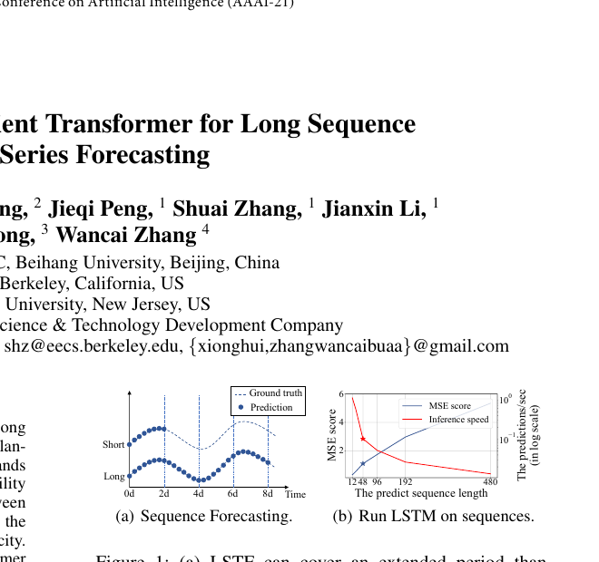
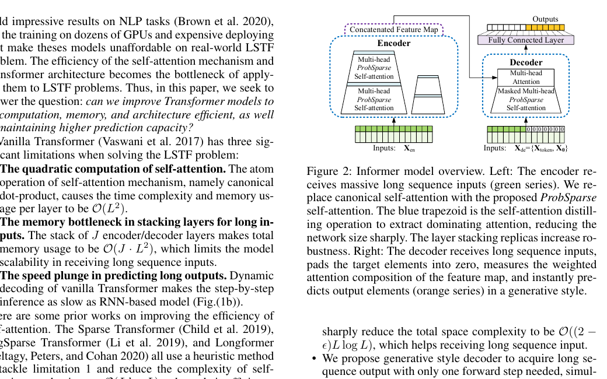
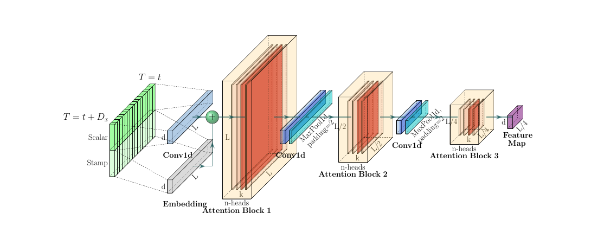
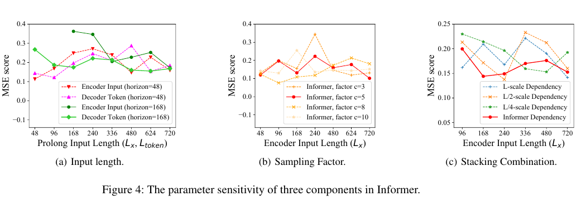
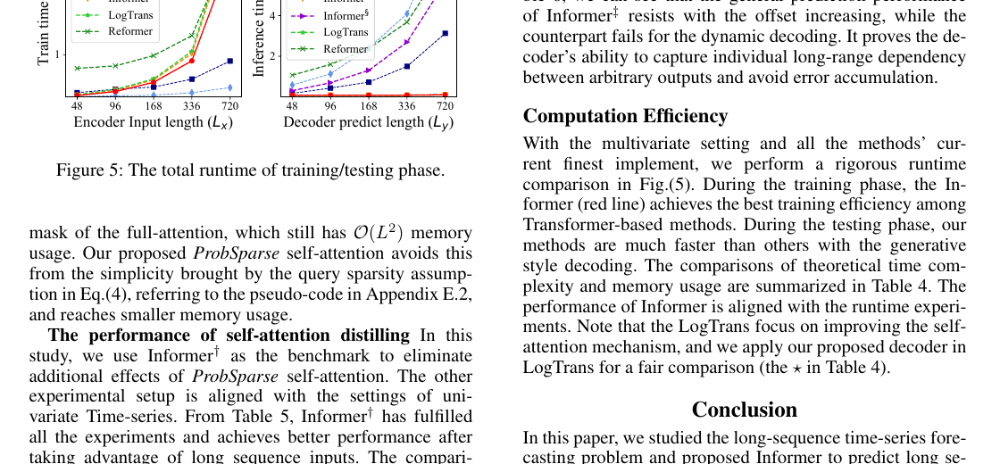

# Informer论文精读

## 前言

今天来看一篇在时序预测里很有代表性的工作：**《Informer: Beyond Efficient Transformer for Long Sequence Time-Series Forecasting》**。[论文原文](./paper/Informer.pdf)

这篇论文发表于AAAI2021，作者来自北航、UC Berkeley、Rutgers等团队。它讨论的不是普通的时间序列预测，而是一个更刁钻的问题：**长序列时间序列预测**。也就是你不只想看未来几个点，而是想一下子看未来很多天、很多周，甚至更长的区间。

我觉得Informer最值得认真读的地方在于，它不是简单把Transformer搬到时序上，而是正面承认了一件事：Vanilla Transformer在LSTF(Long Sequence Time-Series Forecasting)场景里，虽然看起来有长依赖建模优势，但真跑起来会同时撞上三堵墙，分别是`O(L^2)`的注意力复杂度、深堆叠时的内存瓶颈、以及长输出预测时一步一步解码太慢。

这张图真正说明的是，长预测不是“把短预测拉长一点”这么简单。当预测长度超过`48`之后，传统LSTM的误差和推理速度都会一起崩，这也是Informer整篇论文真正要解决的矛盾。

> 在我看来，Informer的历史意义不只是“做了一个高效Transformer”，而是第一次把**预测长度本身**当成架构设计的一等公民。

## 论文定位与历史坐标

Informer的家族谱系其实很清楚。

- 它继承的是`Transformer`这条线，尤其是“自注意力比RNN更擅长建模长距离依赖”的基本判断。
- 它直接挑战的是`LSTM/LSTNet/DeepAR`这类时序预测主流方法，因为这些模型一旦 horizon 拉长，预测能力会明显衰减。
- 它也在和`LogSparse Transformer(LogTrans)`、`Reformer`这类“高效注意力”方法对话，因为这些方法虽然缓解了复杂度，却没有一起解决深堆叠内存和长输出解码的问题。

如果用一句话概括它要解决的“心病”，那就是：

**Transformer看起来适合长依赖，但一旦输入很长、输出也很长，它的计算、内存和解码方式会一起拖后腿。**

这篇论文很像是时序版Transformer的一次“工程总修补”。它不是只抠一个注意力公式，而是把问题拆成三部分：

- 怎样把注意力从`O(L^2)`降下来
- 怎样让encoder能真的吃下超长输入
- 怎样让decoder别再像RNN一样一步一步吐未来

## 模型架构

Informer整体上还是一个encoder-decoder架构，但它已经不是Vanilla Transformer那种原封不动的搬运了。

这张总图最重要，因为它直接把Informer的三根主线摆出来了：左边encoder里的`ProbSparse self-attention`，中间层间的`self-attention distilling`，以及右边decoder里的`generative style`一次性预测。

从主干上看，Informer可以概括成下面这套流程：

- encoder输入长历史序列`X_en`
- encoder内部把标准self-attention替换成`ProbSparse self-attention`
- 每经过一层attention block，就做一次distilling，把时间长度继续压缩
- 多个不同长度输入的stack并联，再把特征拼起来增强鲁棒性
- decoder输入不是完整真实未来，而是`起始token+未来占位符`
- 最后通过一次前向传播，直接吐出整个未来序列

如果按今天的眼光看，这个结构有一点很有意思：Informer并没有试图把decoder做得更复杂，反而是在努力**让长预测摆脱动态解码**。这件事后来其实影响了很多时序模型的设计取向。

## 核心机制

### ProbSparse注意力

Informer最核心的判断是：在长序列里，并不是每个query都同样重要。真正决定输出的，通常只是少数“注意力分布特别尖锐”的query，而大量query算出来其实接近平均分配，信息密度没那么高。

论文先定义了一个query稀疏度的近似度量，用来筛出“峰值高、平均值低”的query：

$$
\bar{M}(q_i,K)=\max_j\left\{\frac{q_i k_j^\top}{\sqrt{d}}\right\}-\frac{1}{L_K}\sum_{j=1}^{L_K}\frac{q_i k_j^\top}{\sqrt{d}}
$$

**【直觉解释】** 这个分数本质上是在找“最该认真看的query”。如果一个query对所有key都差不多，那它的信息量并不高；如果它只对少数key特别敏感，那它更可能对应真正有区分度的依赖关系。

筛出Top-u个dominant queries之后，Informer再只对这部分query做主要的注意力计算：

$$
A(Q,K,V)=Softmax\left(\frac{\bar{Q}K^\top}{\sqrt{d}}\right)V
$$

**【直觉解释】** 这里不是把注意力彻底稀疏到所有query都只看局部，而是只保留少量最有信息量的query去和全量key交互。这样做的重点不是“偷算”，而是把算力集中花在真正会改输出的地方。

论文给出的复杂度结果是`O(LlogL)`时间和`O(LlogL)`内存。这一点很关键，因为Informer不是只想“勉强跑起来”，它是想把长依赖建模真正变成可部署的东西。

在我看来，这个设计最聪明的地方不是稀疏本身，而是它选择了**query稀疏，而不是query-key一起乱稀疏**。这样保留了全局key视野，没把长依赖硬切断。

### Self-attention distilling

只有把注意力复杂度降下来还不够，因为长序列输入一旦层数堆高，encoder的中间特征图还是会很占内存。Informer这里做的第二件事，是在每层attention block之后主动压缩时间长度。

这张图真正说明的是，Informer不是普通的“堆J层encoder”，而是像金字塔一样，一层层把时间维度砍半，同时保留多个stack的输出再做拼接。

论文里的distilling操作写成：

$$
X_{j+1}^t=MaxPool\left(ELU\left(Conv1d\left([X_j^t]_{AB}\right)\right)\right)
$$

**【直觉解释】** 这一步可以理解成“attention之后别把所有时间位置都原封不动往上送”。先做一层局部卷积把模式揉一揉，再激活，再池化，把更强的响应保留下来。它不是单纯降采样，而是在告诉模型：越往高层走，越应该只保留更主导的时序模式。

论文还做了一个很工程化的补丁：除了主stack之外，还把输入切成`L`、`L/2`、`L/4`这类不同长度的副本并联。这样不是为了花哨，而是为了让distilling别因为连续压缩把某些信息压没了。

我觉得这里最有趣的是，Informer其实在做一种“attention版特征金字塔”。它不是在空间图像上做下采样，而是在时间维度上做层间浓缩。

### 生成式解码

Informer的第三个关键点，是它对decoder的态度非常明确：**长预测不能再搞动态解码。**

论文把decoder输入写成：

$$
X_{de}^t=Concat(X_{token}^t,X_0^t)
$$

**【直觉解释】** decoder拿到的不是一整段真实未来，而是一小段已知起始片段`X_token`，再拼上一大段未来位置的占位符`X_0`。这等于提前把“要预测哪些位置”一次性交代清楚，然后直接整段生成。

这件事听起来简单，但它直接改掉了Vanilla Transformer在预测阶段最慢的部分。传统dynamic decoding每生成一步都要再跑一遍decoder，而Informer是一口气把整个未来区间都吐出来。

论文还特别强调，这种做法还能减少误差累积。因为一步一步自回归时，前一步错了，后面会继续接着错；而Informer把整个未来看成一次条件生成，误差传播链会短很多。

### 这三招为什么是一起出现的

如果只看单个模块，Informer很容易被误读成“一个ProbSparse attention论文”。但我读完更强的感受是，它其实是一个**系统级修补方案**：

- `ProbSparse`解决的是每层算不算得动
- `distilling`解决的是堆深之后存不存得下
- `generative decoder`解决的是长输出推得快不快

少了任意一块，Informer都不会成为真正适合LSTF的模型。

## 例子或输入输出/数据流

论文里给了一个很直观的生成式例子：如果要预测未来`168`个点，比如未来`7`天的小时级温度，那么decoder不再一步一步生成，而是拿一段历史片段当作start token，再把未来部分先占位。

为了说清楚，我用一个接近论文设定的例子来走一遍。

假设现在做`ETTh1`上的长预测：

- encoder输入是过去一长段历史序列`X_en∈R^{L_x×d_model}`
- 目标是一次性预测未来`L_y=168`个点
- decoder输入由两部分组成：
  - `X_token`：目标区间前一小段已知历史，比如论文举的`5`天上下文
  - `X_0`：长度为`168`的零占位序列，但保留这些位置对应的时间戳特征

整个数据流可以理解成这样：

1. 历史序列进入encoder，先做embedding和时间特征编码。
2. 每层encoder用ProbSparse attention挑出最值得计算的query。
3. attention block后做distilling，把时间维度压缩一半。
4. 多个stack的输出拼成最终encoder表示。
5. decoder接收`X_token+X_0`，通过masked attention和encoder-decoder attention建立未来区间与历史区间的依赖。
6. 最后一层全连接直接输出未来`168`个点，而不是循环`168`次。

训练和推理的差别也很值得单独说一下：

- 训练时，模型一次性输出整段未来，再和真值整段对齐，用MSE反向传播。
- 推理时，也是一口气输出整段未来，不需要像RNN或标准Transformer那样逐步回填。

这就是Informer特别像`Transformer.md`里那种“想明白以后再讲”的地方：它真正的速度优势，不只是注意力省算，而是**训练和推理都在朝一次性整段预测靠拢**。

## 横向异同PK

| 方法 | 核心思路 | 长处 | 代价 |
| --- | --- | --- | --- |
| Vanilla Transformer | 全量self-attention+标准encoder-decoder+动态解码 | 全局依赖建模最直接 | `O(L^2)`计算与内存，长输出推理太慢 |
| LogTrans/LogSparse | 用稀疏注意力缓解复杂度 | 比原版Transformer更能处理长序列 | 主要修的是注意力本身，没有一起解决堆叠内存和解码速度 |
| Reformer | 哈希近似注意力，降低复杂度 | 理论效率漂亮 | 对极长序列友好，但在LSTF里配合动态解码效果一般 |
| LSTM/LSTNet/DeepAR | 递归或卷积式时序建模 | 短期预测稳，工程上成熟 | horizon一长，长依赖和推理效率都开始吃亏 |
| Informer | ProbSparse+distilling+一次性解码 | 把长输入、深堆叠、长输出三个问题一起修 | 架构明显更任务定制，也依赖“query稀疏”这个经验前提 |

我觉得Informer和其他高效Transformer最大的差别，不是它把复杂度从二次降到了对数级附近，而是它意识到：**LSTF不是单层attention问题，而是整套推理路径问题。**

如果只修attention，不修decoder，最后还是会卡在推理阶段；如果只修decoder，不修encoder堆叠，长输入还是吃不下。Informer厉害就厉害在它看问题看得更完整。

## 多元视角透视

### 审稿人视角

从论文论证链来看，Informer是比较扎实的。

- 先清楚定义了Vanilla Transformer在LSTF里的三类瓶颈。
- 然后每一个瓶颈都给出对应结构修改，而不是只抛一个“高效attention”大词。
- 最后又用Table 3、Table 5、Table 6把三块改动分别拆开验证。

不过它也不是没有可以挑的地方。比如`query sparsity`这个核心假设，本质上还是一个经验判断，再加上输入表示细节被放进Appendix B，正文可读性其实没有那么平滑。换句话说，它是强工程论文，不是那种一眼就“理论闭环无懈可击”的文章。

### 工程师视角

从工程落地角度看，Informer有两个特别实在的优点：

- 一次性整段预测，部署时延会比动态解码友好很多。
- `O(LlogL)`级别的注意力和distilling，让长窗口输入终于不是一句空话。

但它也不是零门槛的。

- 你需要比较高性能的GPU。
- sampling factor、input length、stack组合都会影响效果。
- 它明显是为LSTF量身定做的，不是所有时序任务都能无脑复用。

### 初学者视角

我觉得初学者最容易卡住的点有两个。

- 第一，会把Informer误解成“就是把attention做稀疏”。
- 第二，会不太明白为什么decoder的一次性生成这么重要。

如果是第一次读这篇论文，我建议先只抓住下面这条主线：

**Informer不是在发明一个更炫的attention，而是在让Transformer真正适配“输入长、输出也长”的预测任务。**

顺着这条线再去看三个模块，理解会顺很多。

## 实验结果

### 主结果：长预测一拉长，Informer的优势才开始显现

论文在四个数据集上做了单变量和多变量实验，最有代表性的是长预测窗口下的结果。

先看单变量`ETTh1`：

- 预测`168`步时，Informer的MSE是`0.183`，LSTMa是`0.236`，DeepAR是`0.239`
- 预测`336`步时，Informer的MSE是`0.222`，LSTMa已经涨到`0.590`
- 预测`720`步时，Informer的MSE是`0.269`，而LSTMa是`0.683`，Prophet甚至到了`2.735`

论文正文直接总结了这个趋势：相对LSTMa，Informer在`168/336/720`三个长窗口上，MSE分别下降了`26.8%`、`52.4%`、`60.1%`。

这组数字为什么重要？因为它说明Informer的价值并不在短 horizon 上刷一个小数点，而是在**预测区间一旦真正拉长，别的方法开始掉队时，它还能稳住**。这才叫“prediction capacity”。

### 参数与鲁棒性：它不是只能在一个甜点超参上工作

这张图真正说明的是，Informer的三个关键部件并不是随便拍脑袋拼起来的。长预测时更长的encoder输入确实更有帮助，sampling factor从小到大变化后性能会稳定下来，而`L+L/4`这样的stack组合比单一路径更鲁棒。

我对这组实验的理解是：Informer不是“某个魔法超参刚好有效”，而是整套设计在趋势上是自洽的。

### ProbSparse不是嘴上省复杂度，表里也真能赢

论文在Table 3里专门把`Informer`和`Informer†`、`LogTrans`、`Reformer`拿出来做ProbSparse相关对比。Table 4又把每层理论复杂度和推理步数单独列出来：

- Informer：时间复杂度`O(LlogL)`，内存复杂度`O(LlogL)`，预测步数`1`
- Transformer：时间复杂度`O(L^2)`，内存复杂度`O(L^2)`，预测步数`L`

这一点我觉得非常关键，因为很多“高效attention”论文最后停在复杂度表。Informer不是，它后面还有runtime实验把这件事坐实。

### Distilling和生成式decoder都不是装饰件

论文的两个消融实验很能说明问题。

- 在Table 5里，拿掉distilling后的`Informer‡`在更长输入下会直接OOM，尤其输入长度大于`720`之后，很多格子已经变成`-`。
- 在Table 6里，把Informer的decoder换回动态解码后，offset一变大结果就明显崩掉。比如预测长度`480`时，生成式decoder在`+0` offset下MSE是`0.198`，动态解码版本已经到`0.392`，后面更多offset甚至直接失败。

这两张表我觉得特别有说服力，因为它们告诉你：

- distilling解决的真的是“能不能把长输入吃下去”
- generative decoder解决的真的是“长输出能不能一次性稳定吐出来”

也就是说，Informer的三块设计都不是可有可无的拼图。

### 运行效率：它不是只准不快，也不是只快不准

这张图真正说明的是，Informer的优势并不只停留在误差指标。训练阶段它已经是Transformer系里效率最好的之一，测试阶段因为用的是生成式decoder，速度优势会更明显。

这里我最喜欢的一点是，论文没有只拿精度说事，而是把训练和测试时间一起摆出来。因为在LSTF场景里，预测窗口很长时，推理速度本身就是模型可用性的一部分。

## 总结

读完Informer之后，我会觉得这篇论文最重要的贡献，不是单独发明了一个稀疏attention技巧，而是第一次比较系统地回答了一个问题：

**如果真的要用Transformer做长序列预测，应该从哪里动刀，才能让它既能看得远，又能跑得动，还能一次性把未来吐出来？**

Informer给出的答案是三件事一起做：

- 用ProbSparse attention把主要算力集中到少数重要query上
- 用distilling把层间时间维度逐级压缩
- 用generative decoder把长输出从动态解码改成一次性预测

如果放回历史位置看，我觉得Informer像是时序Transformer早期阶段的一篇“关键过桥论文”。它还没有后面Autoformer、FEDformer、PatchTST那种更成熟的任务归纳，但它把几个非常重要的思路先讲明白了：

- 长预测不能只靠RNN硬熬
- 注意力复杂度、内存占用和推理模式必须一起考虑
- 时序预测里的decoder，不一定非得走token-by-token那条老路

当然，今天再回头看，Informer里有些具体设计已经不是最主流了。比如ProbSparse这类手工稀疏规则，后来并没有成为唯一赢家；而时序建模也越来越重视分解、频域、patch化这类更强归纳偏置。

但在我看来，Informer留下来的真正遗产不是某个局部公式，而是一个更现实的判断：**长序列预测要把“预测能力”和“推理效率”一起设计，而不是先把模型堆大，再祈祷它能部署。**
