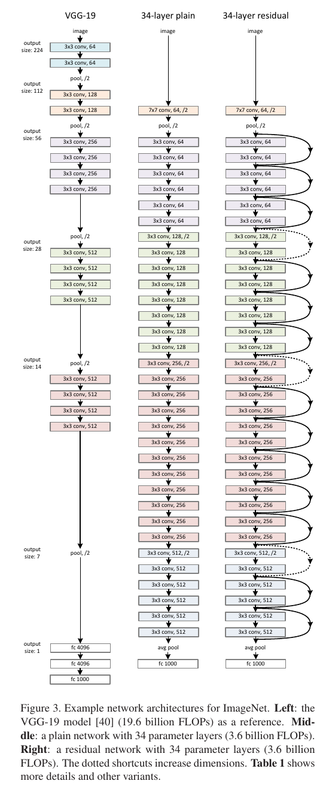
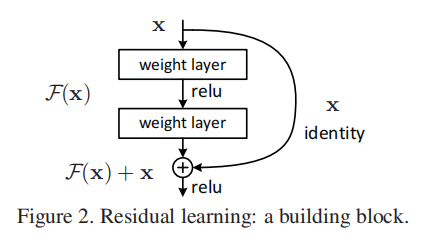
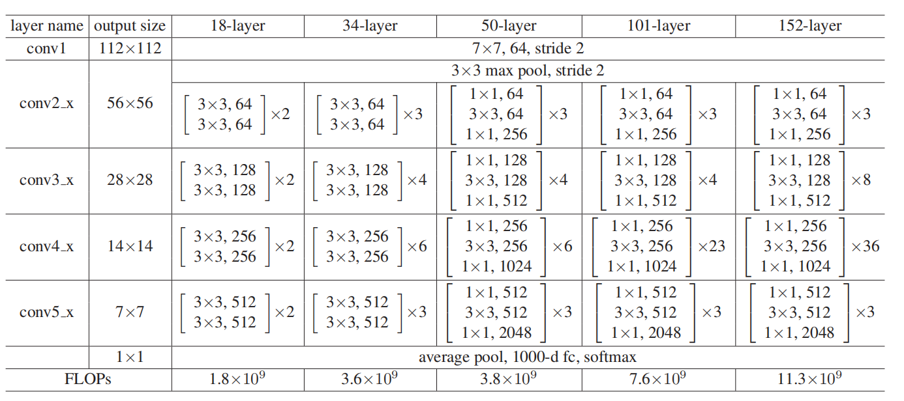
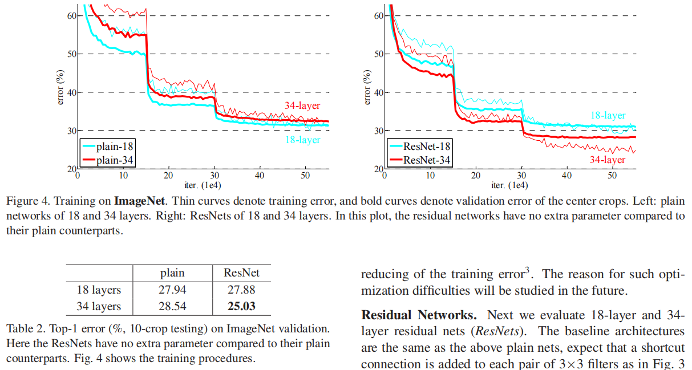
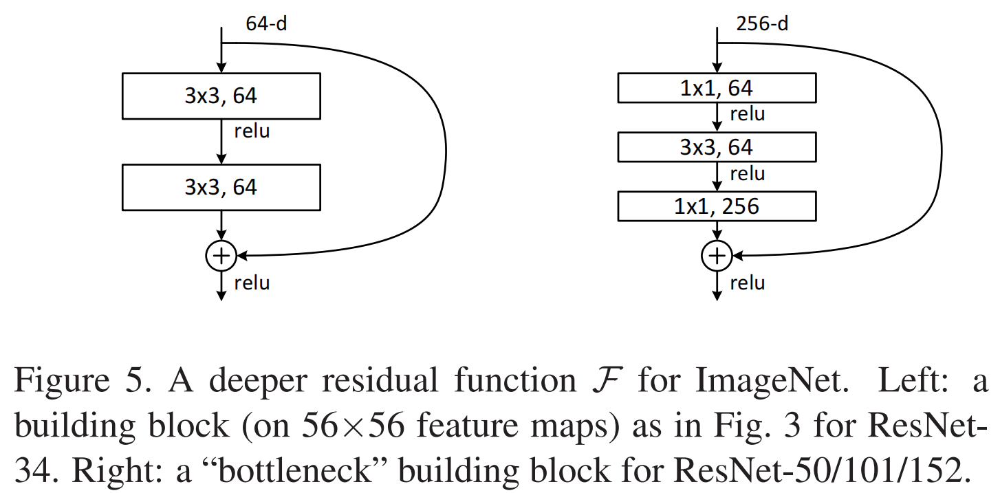

# ResNet 论文精读

## 前言

今天看一下 **《Deep Residual Learning for Image Recognition》**，也就是ResNet。[论文原文]([./paper/ResNet.pdf](https://openaccess.thecvf.com/content_cvpr_2016/papers/He_Deep_Residual_Learning_CVPR_2016_paper.pdf))

ResNet提出了 **残差residual** 模块，也就是跳连接，它解决了**网络加深反而性能下降**的问题。

## 模型架构

先看论文里的整体结构图。

这张图特别有意思，因为它没有直接只画ResNet，而是把三件事并排摆在一起：

- 左边是VGG-19，上一篇笔记有介绍
- 中间是34-layer plain network，也就是模型继续加深
- 右边则在中间图的基础上添加了残差块

其实作者并不是一开始就说“我要发明一条 shortcut”，而是先搭了一个plain baseline，再问一个更根本的问题：如果只是继续叠更多层，为什么**训练会更难**？

ResNet的基本构件也非常简单。

论文里把原本想学习的映射记成 `H(x)`，然后不再直接让几层网络去拟合它，而是改成去拟合一个残差函数 `F(x)`：

$$
H(x)=F(x)+x
$$

也就是说，网络不再从头学“完整变换”，而是学“在输入 `x` 的基础上，还要补多少东西”。如果最优解本来就接近恒等映射，那让网络把残差学成接近 `0`，会比硬去逼几层非线性堆栈学出一个 identity mapping 容易得多。

**当然了，这里的拟合残差是在特征表面做的，而GBDT拟合残差是在label做的。这两种方式是一个值得对比的点。**

shortcut这个直觉听起来非常简单，但它几乎改写了后面所有深网络的设计习惯。读到这里我最大的感受是，ResNet的厉害不在于结构有多复杂，恰恰在于它把问题重新表述得特别对。

对于 ImageNet，论文里主要用了两类 block：

- `18`/`34` 层使用最基础的两层 `3x3` block
- `50`/`101`/`152` 层改用 `1x1 -> 3x3 -> 1x1` 的bottleneck block

下表直接展现了这几种网络在每个stage上到底堆了多少block

更深模型的大致堆叠是：
- ResNet-50：`3, 4, 6, 3`
- ResNet-101：`3, 4, 23, 3`
- ResNet-152：`3, 8, 36, 3`

模型的主干很清晰，它能更深，取决于**shortcut**让优化变得可行了。

### 从过拟合到退化

很多人后来回忆 ResNet，会直接把它和缓解梯度消失绑定在一起。但论文其实讲得更细。作者明确说，在BatchNorm已经广泛使用之后，网络并不是完全训不动了，真正暴露出来的问题是**degradation：深层网络不只是测试误差更高，连训练误差都更高。**
这就很关键了。因为如果只是过拟合，那应该是训练误差低、测试误差高；但现在连训练集都做不好，说明问题出在优化本身。

上图可以看到，左边`34-layer plain`的训练误差居然比`18-layer plain`更高；右边换成ResNet后，情况反过来了，`34-layer ResNet` 明显优于 `18-layer ResNet`。说明模型即使再深，后面的层学不到东西也能用前面的层保持梯度更新。

论文里一直在强调一个点：identity shortcut几乎不引入额外参数，也几乎不增加计算复杂度，训练不下去，能真的让模型走捷径正常更新。

### Bottleneck的突破

如果ResNet只有18层、34层，我觉得它还不至于后来影响这么大。它真正把历史位置坐实，是因为论文进一步把网络拉到了`50`、`101`、`152`层，而且效果还真的继续涨。

这里的关键就是bottleneck设计：先用 `1x1`降维，再用`3x3`做主计算，最后再用`1x1`升维。说白了就是降计算量。

## 总结

这篇论文真正伟大的地方，并不是加了一条跳连接这么简单，而是它第一次把深网络训练里的核心矛盾说透了，然后用一个极其朴素的结构改写把它解决掉了。

如果说VGG让大家看到继续堆深是有收益的，那 ResNet更像是在证明更深的网络能训得动。
在我看来，ResNet不只是CNN时代的一篇强论文，它更像是深度学习模型设计里的一个基础操作系统。从那之后，很多模型虽然长得不一样了，但那条残差路径，几乎一直都还在。
