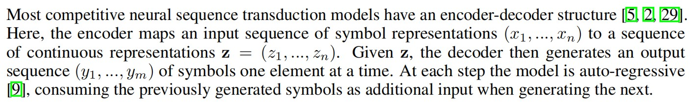
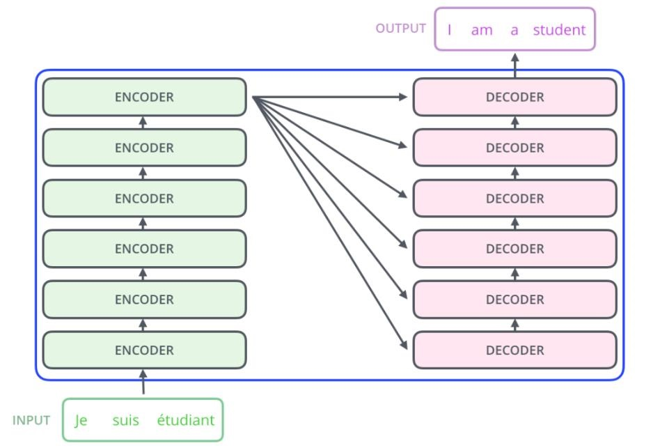
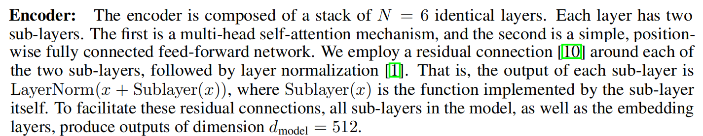
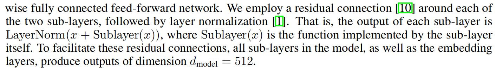

## 前言

今天来看一下Transformer模型，由Google团队提出，论文名为《Attention Is All You Need》。[论文地址](https://proceedings.neurips.cc/paper/2017/file/3f5ee243547dee91fbd053c1c4a845aa-Paper.pdf)。
正如标题所说的，注意力是你所需要的一切，该模型摒弃了传统的RNN和CNN结构，网络结构几乎由Attention机制构成，该论文的亮点在于提出了**Multi-head attention**机制，其又包含了**self-attention**，接下来我们将慢慢介绍该模型的原理。

## 模型架构

正如文中提到大多数的序列传导模型都含有encoder-decoder结构，Transformer的encoder是将一段表征序列$(x_1,\cdots,x_n)$映射为另一种连续表示的序列$(z_1,\cdots,z_n)$，即encoder的输出信息；而decoder是将encoder输出和decoder前一步的输出**自回归**的共同生成序列$(y_1,\cdots,y_m)$。举个例子，现在有一个机器翻译任务，首先将句子embedding为高维向量，输入encoder中，其输出随后输入decoder进行解码得到最终翻译结果，如下图所示。

需要注意的是，Transformer的输出$y_i$是一次一次自回归的生成的，也就是每一次输出都需要调用最后一层encoder的输出序列。这里不像多层RNN隐层的并行传递，Transformer是串行的。如下图所示。

### Encoder和Decoder
好了，接下来该介绍encoder和decoder的神秘面纱了，如下图所示。

在读论文时第一眼看这个架构图，一开始是比较懵的，这到底做了些啥操作。后来看了[李沐老师讲解的Transformer](https://www.bilibili.com/video/BV1pu411o7BE/?spm_id_from=333.337.search-card.all.click&vd_source=ca5cb380410734fb2e1357fe1e104471)才有了一定的理解。

#### Encoder
回到论文的讲解！

这里说到作者实验用到了6层的encoder，这里是为了学到更多的语义信息。并且每层encoder都包含两个子层，分别是**多头注意力机制Multi-head attention**和**前馈神经网络FFN**。当然了，作者对两个子层的输出都做了**residual连接**和**Layer normalization(LN)**，加了残差连接是为了网络能搭的更深，并且容易训练，防止梯度消失；而LN完全是针对每一个样本自身的特征缩放，能将每个词都归一为相同空间的语义信息。BN也是一种常见的特征缩放方法，常用于CNN，不适用于NLP任务，因为其对所有batch的同一个特征做缩放，在图像中是非常友好的，而NLP中每一个sequence的长度是不一样的，所以在同一个batch中越长的语句得不到充分的缩放表示。

#### Decoder

同样的，作者实验用到了6层decoder，不同于encoder，这里作者还设置了**mask**的multi-head attention，其原因在于在解码时，模型是看不到整条句子的，因此，必须在当前时刻掩码掉后面的词，才能做到正确训练和有效预测。

### Attention
谈到注意力机制，像我们人一样，看到一幅图片，我们会关注其强烈的表征现象，能让我们快速了解新事物的信息，如下图所示。特别在处理NLP任务中，长距离的记忆能力是一个难题，引入注意力机制，关注更重要的词，可以缓解这一现象。

在Transformer中，每个单词embedding为三个不同的向量，分别是$Query$向量$Q$、$Key$向量$K$和$Value$向量$V$。具体来说，对于一个句子，只需要将其输入到三个linear层，通过学习三个$W$参数就能得到不一样的$Q、K、V$。至于为什么说$Q、K、V$要不一样，其实一样也可以，但是这里为了**增强数据的表达能力**，保证在$QK^T$矩阵内积时可以**得到不同的空间投影**，**提高模型泛化能力**。

生成的$Q、K、V$矩阵后便可以进行attention计算了，如下图所示

假设有三个矩阵$Q、K、V$，维度分别为$(d_q, d_{model})、(d_k, d_{model})、(d_v, d_{model})$，其中$q=k=v$。
1. 首先进入的是**Multi-Head Attention**多头注意力机制。这里可以h层，也就是我们说的`多头`，类似cv中的channel数量，能学习更多维度信息。多头注意力机制中包含了Scaled Dot-product Attention，也是**self-attention**。
2. 其次进入self-attention，对于每个sequence，用它的query矩阵: $(d_q, d_{model})$和key向量shape: $(d_k, d_{model})$进行内积，本质上是求解每个词之间的`余弦相似度`，如果两者相似度较高，则赋予较大的值来反应两者的关系，反之如果是正交的，内积为0，则它们就没有相似性，这里输出的attention score矩阵维度是shape: $(d_q, d_k)$。
3. 再次将输出矩阵进行scale缩放相似度，为了防止softmax推向梯度平缓区，使得收敛困难，公式如$\text{Attention}(Q、K、V)$所示。
4. 从次是通过可选的mask操作，为了保证decoder得到sequence的leak信息。具体来说是通过将权重矩阵添加一个上三角的负无穷矩阵，这样softmax就能将这些值推为0，即无权重，保证mask的作用。
5. 最后将attention score矩阵shape: $(d_q, d_{k})$与Value矩阵shape: $(d_v, d_{model})$内积，得到encoder后的sequence信息表征shape: $(d_q, d_{model})$。

Scale缩放公式：
$$
\begin{aligned}
    \text{Attention}(Q、K、V)=\text{softmax}(\frac{QK^T}{\sqrt(d_k)})V
\end{aligned}
$$

Multi-head公式：
$$
\begin{aligned}
    \text{Multihead}(Q、K、V)=\text{Concat}(\text{head}_i,\cdots,\text{head}_h)W^O\\
    \text{where} \text{ } \text{head}_i=\text{Attention}(QW_{i}^{Q},QW_{i}^{K},QW_{i}^{V})
\end{aligned}
$$

上述的操作执行完后，便可以通过多个头的concat将矩阵拼接，随后通过linear层降维，完成Multi-head attention的过程。

值得注意的是多头数量必须可被$d_{model}$整除。这个很好理解，在CNN中，我们经常将feature map的width和height升维后，会把channel数降低，学到更深的信息一个道理。

### FFN
除了注意子层外，encoder和decoder中的每个层都包含一个完全连接的前馈网络，它分别和相同地应用于每个位置。这由两个线性变换组成，中间有一个ReLU激活。换句话说就是MLP模型。公式如下所示：

$$
\begin{aligned}
    \text{FFN}(x) = \text{max}(0, xW_1 + b_1)W_2 + b_2
\end{aligned}
$$

论文作者给定了MLP的中间状态输出维度为2048，而最后输出维度为512，当然就是512->2048->512这样变换。

### Embeddings和Positional Encoding

#### Embeddings
在Transformer中，在嵌入层中，这些权重乘以$\sqrt{d_{model}}$。其原因是在嵌入层学emdedding的时候，在L2norm后，不管维度多大最终权重都会比较小，但后续要和positional encoding相加(不会经过norm)，需要保持差不多的scale。

#### Positional Encoding
self-attention对输入sequence中各单词的位置或者说顺序不敏感，因为通过Query向量和Key向量的内积，本质上就是一些词由其他词的线性表出，并没有说有位置的信息存在。比如“我吃牛肉”这句话，在Transformer看来和“牛吃我肉”是没什么区别的。
为了缓解该问题，作者提出了位置编码。简而言之，就是在词向量输入到注意力模块之前，与该词向量等长的位置向量进行了按位相加，进而赋予了词向量相应的位置信息。

作者给出了位置编码的定义公式，具体如下：

$$
PE_{pos, 2i}=sin(pos/10000^{2i/d_{model}}) \\
PE_{pos, 2i+1}=cos(pos/10000^{2i/d_{model}})
$$

这样通过$sin(\alpha+\beta)=sin(\alpha)cos(\beta)+cos(\alpha)sin(\beta)$。可以将牛(pos=3)可以由pos=2和pos=4表达，使得Transformer可以更容易掌握单词间的相对位置。

## 总结

关于Transformer比较重要的点基本上就这些，当然还有很多细节的地方需要去探索，接下来我将会写更多的论文分享，总结一些经典的模型。