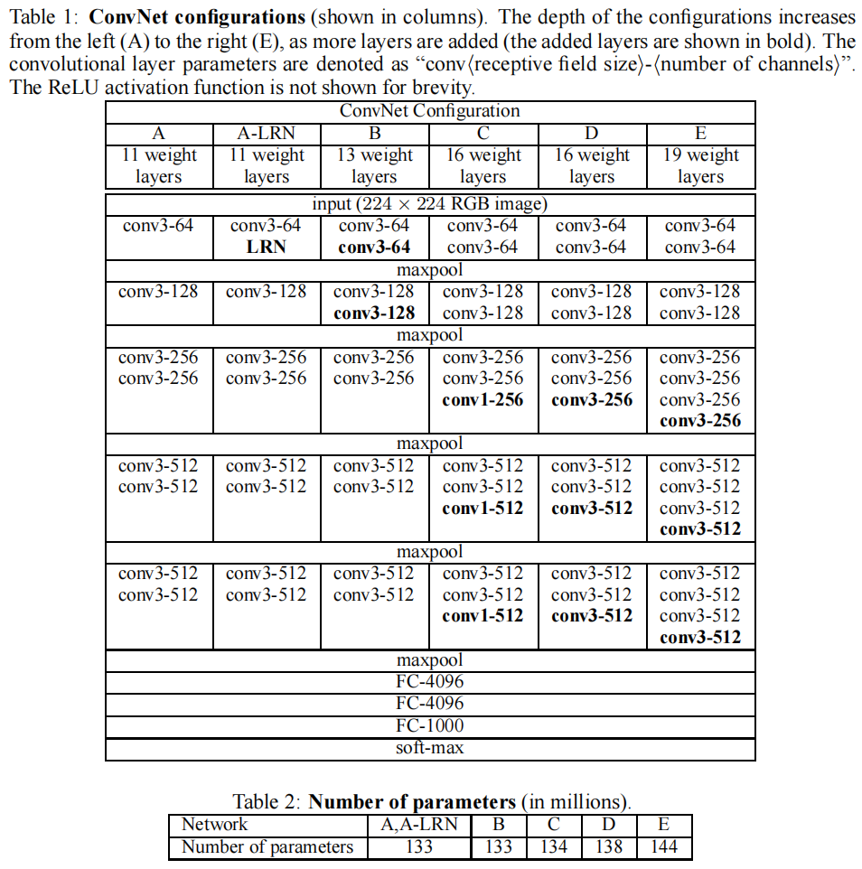
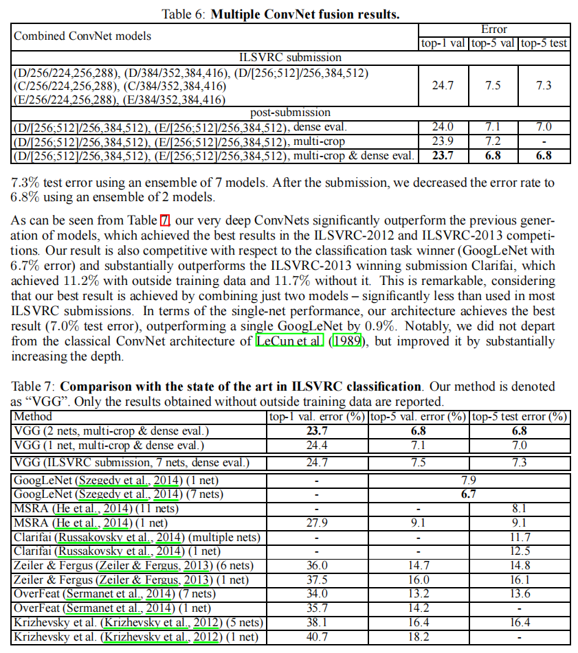

# VGG 论文精读

## 前言

今天来看一下2014年的文章：**《Very Deep Convolutional Networks for Large-Scale Image Recognition》**，也就是后来大家特别熟悉的`VGG` [论文原文](https://arxiv.org/pdf/1409.1556)，在2014年拿下了ILSVRC亚军，当然了冠军是`GoogleNet`。

这篇论文放到现在读，第一感觉其实不是“花哨”，而是特别克制。它没有像 GoogleNet 那样设计复杂的分支模块，也没有像后来的 ResNet 那样引入一个一眼就能看出范式变化的新连接方式。VGG 做的事情看起来很朴素，就是抓住一个问题一直往下追：如果卷积网络继续加深，而且结构尽量保持统一、简单，效果到底会不会继续提升？

我读完之后最大的感受是，VGG 的价值不只是留下了 VGG16、VGG19 这些后来几乎人人都知道的名字，更重要的是它把**深度本身是不是有效**这件事，用一种非常干净、非常扎实的方式证明了一遍。

## 模型架构

VGG 原论文里其实没有单独画一张花哨的总架构图，最核心的结构信息直接放在 `Table 1` 里了。所以如果要看原文框架，我觉得这张表反而比后人画的各种简化图更重要。

这张表把 VGG 的主线讲得很清楚。论文一共测试了 `A` 到 `E` 五组主配置，外加一个 `A-LRN` 对照版本：

- `A` 最浅，`11` 个 weight layers
- `B` 是 `13` 层
- `C` 和 `D` 都是 `16` 层
- `E` 最深，`19` 层

后来大家熟悉的：

- VGG16 基本对应配置 `D`
- VGG19 基本对应配置 `E`

它们的共同骨架非常统一：

- 输入都是 `224x224` RGB 图像
- 卷积层几乎都用 `3x3` 小卷积核，stride 为 `1`
- padding 设成 `1`，尽量保持空间分辨率
- 一共用了 `5` 次 `2x2, stride 2` 的 max-pooling
- 通道数按 `64 -> 128 -> 256 -> 512 -> 512` 逐步增加
- 最后接 `3` 个全连接层，其中前两个是 `4096`

这种规整感，是我觉得 VGG 非常有代表性的一点。它不像一些网络那样每到一层就换一种花样，而是尽量让整个网络像一个可以系统比较的实验平台。论文甚至连 `A-LRN` 这种带归一化的版本都专门放进去，明显就是想把“到底是什么带来了提升”这件事说清楚。

另外一个很有意思的细节是参数量。原文 `Table 2` 里给出的数字是：

- A / A-LRN：`133M`
- B：`133M`
- C：`134M`
- D：`138M`
- E：`144M`

也就是说，VGG 虽然很深，但作者并不是靠无限加宽通道去蛮力堆模型。它真正做的，是在相对统一的宽度设置下，把网络更有节制地堆深。

### VGG核心贡献：小kernal堆叠

很多人提到 VGG，第一反应就是“VGG16 很深”。但如果只停在“更深”，我觉得还没有抓到重点。VGG 真正关键的地方，是它坚持用很多个 `3x3` 小卷积去堆，而不是继续沿着更大卷积核的路线走。

论文里专门做了这个讨论。比如：

- 两个连续的 `3x3` 卷积，等效感受野大致对应一个 `5x5`
- 三个连续的 `3x3` 卷积，等效感受野大致对应一个 `7x7`

但这样做会带来两个好处：

- 非线性层更多，表达能力更强
- 参数更少

原文里给了一个很典型的对比。如果输入输出通道数都是 `C`：

- 三层 `3x3` 卷积大约需要 `27C²` 个参数
- 一层 `7x7` 卷积大约需要 `49C²` 个参数

也就是说，用多个小卷积核堆叠，不只是“深一点”，而是更省、更灵活、非线性更多。读到这里我会觉得，VGG 最厉害的地方，不是把网络做得很复杂，而是把“深”这件事变成了一种非常干净的结构原则。

**VGG做了一组非常系统的深度对照实验。**
从 `A` 到 `E`，大体只有深度在持续增加，其他设计尽量保持一致。这样带来的好处是，论文回答的问题就很干净了：如果结构风格不乱变，只是把网络一点点做深，性能会不会继续提高？

答案是会，而且很明显。

在单尺度测试的 `Table 3` 里，top-5 validation error 大致从：

- `A` 的 `10.4%`
- 降到 `D` 的 `8.8%`
- 再到 `E` 的 `8.0%`（配合 scale jitter training）

这个趋势非常关键。因为它说明卷积网络不是加到 AlexNet 那个深度就差不多了，继续往更深走，确实还有空间。

而且论文里还有两个很有意思的对照：

- `A-LRN` 并没有比 `A` 更好，说明 LRN 在这里没有带来收益
- `C` 和 `D` 深度相同，但 `D` 比 `C` 更强，说明 `1x1` 线性投影并没有比继续用 `3x3` 堆叠更有效

这两个结论都很重要。因为它们说明 VGG 的提升并不是靠“多加几个流行技巧”，而是真的来自对结构本身的打磨。

## 实验结果

先看分类任务：

- 最好的单模型结果是 `7.0%` top-5 test error
- 两个模型融合后，top-5 test error 进一步降到 `6.8%`
- 论文提交比赛时，7 个模型的 ensemble 是 `7.3%`

这里最有意思的一点，是 VGG 的**单模型**已经非常强。论文里明确说，单个 VGG 模型比单个 GoogLeNet 还低 `0.9%` 的 top-5 test error。也就是说，VGG 不是只靠大规模集成才有竞争力，它单网本身就已经很能打。

当然，如果看最终比赛名次，分类冠军还是 GoogLeNet 的 `6.7%`，VGG 以 `6.8%` 排第二。这个差距其实已经非常小了。考虑到 VGG 的结构比 GoogLeNet 规整得多，这个结果本身就很说明问题。

再看 localisation，VGG 在 ILSVRC-2014 上拿到了第一：top-5 test localisation error：`25.3%`

论文里还专门和 GoogLeNet、OverFeat 做了对比，VGG 的 localisation test error 优于 GoogLeNet 的 `26.7%`。这个点很重要，因为它说明 VGG 学到的特征不只是拿来做最后分类，它对空间定位也同样有效。

还有一个很容易被低估的部分，是 Appendix B 里的迁移实验。作者把 `Net-D` 和 `Net-E` 当成通用特征提取器，拿去做 VOC、Caltech 和 action classification，结果都非常强。也正因为这样，VGG 后来才会在目标检测、分割、风格迁移、感知损失这些方向被反复拿来当 backbone。

## 影响力

我觉得 VGG 的影响力，主要来自三件事。

第一，它把“更深的网络有效”这件事讲得非常清楚。不是靠复杂结构，而是靠统一的小卷积核堆叠，再配合扎实实验，把深度本身的收益证明出来。

第二，它的结构特别规整，所以迁移性极强。后面无论是 Fast R-CNN、FCN，还是一大批早期视觉任务，只要需要一个稳定、通用、容易替换的 backbone，VGG 都是很自然的选择。

第三，它留下的是一种设计倾向：宁可让结构简单统一，也不要过早把模型做得过于花哨。这个思路后来其实影响了很多人。哪怕后面大家不再直接用 VGG 的大 FC 头和巨量参数，它那种“把主干做规整”的风格，还是留了下来。

当然，从今天回头看，VGG 的问题也非常明显：

- 参数量很大，尤其全连接层很重
- 计算开销不低
- 没有残差连接，继续往更深走会很难训

但这些都不影响它的历史地位。因为它真正留下来的，不是某一个固定层数，而是一条非常重要的经验：**只要结构设计足够规整，小卷积核堆叠起来，深度本身就能带来实打实的收益。**

## 总结

读完 VGG 之后，我会觉得这篇论文最厉害的地方，不是提出了什么特别炫的新模块，而是把一件看似简单的事做到了极致：坚持用统一的小卷积核，把网络一点点堆深，然后用很扎实的实验告诉大家，这条路是走得通的。

如果说 AlexNet 让大家第一次看到深度卷积网络在 ImageNet 上的爆发力，那么 VGG 更像是把这条路往前推到了一个非常关键的中间阶段。它没有 GoogLeNet 那么强调模块创新，也没有 ResNet 那么彻底改变深网络训练方式，但它非常扎实，而且影响特别长尾。

虽然今天再回头看VGG ，它也许已经不是最实用的网络，但它依然是 CNN 发展史里绕不过去的一篇论文。因为它把**深度有价值**这件事，真正讲明白了。
